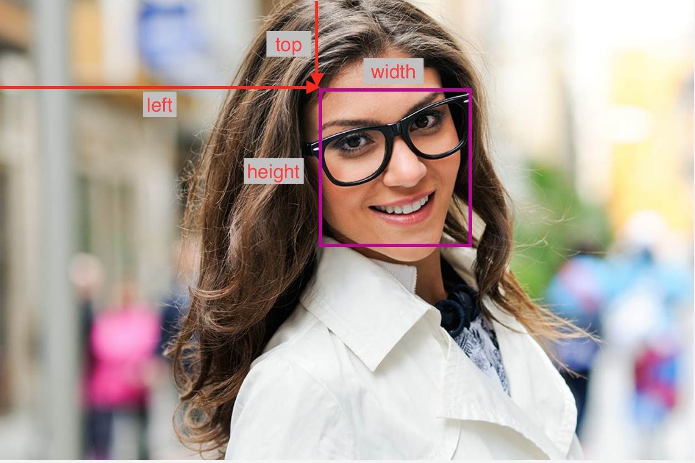

# HOTH V Microsoft Image Recognition API workshop

* __Location__: De Neve Sycamore Room
* __Time__: 2018 Nov 17 2:00pm - 3:00pm

* __Teacher__: Galen Wong

## Resources

* [Slides(TODO)]()

* [Jimp 🖍 Documentation](https://github.com/oliver-moran/jimp/tree/master/packages/jimp)

* [Online demo of Azure Computer Vision API](https://azure.microsoft.com/en-us/services/cognitive-services/computer-vision/)

* [A Node.js Example of using the API](https://docs.microsoft.com/en-us/azure/cognitive-services/face/quickstarts/node)

* [Azure Cognitive Service Documentation](https://azure.microsoft.com/en-us/services/cognitive-services/directory/vision/)

## What we'll be learning today
* What is an API?
* How to use Microsoft Image Recognition API.


## What is an API?

API stands for __Application Programming Interface__. 
An API is a definition of methods of communication among various components.

In the context of this workshop, 
treat API as an URL that you can send and retrieve data from.

## What is a HTTP request?

HTTP stands for __Hypertext Transfer Protocol__.

The HTTP protocol defines how the request from the client should be formatted, and also how the response from the server should be formatted.

A request is just a string that is being sent to the server. The rules set by HTTP allow the server to interpret the string to understand what user wants.


A HTTP request is usually comprised of two parts: the __header__ and the __body__.

* A header is piece of text (string) that a client sends to a server containing what the user wants from the server.

* If you are uploading images or text, for example, the body will contain all the data.


## Microsoft Azure Cognitive Service

Microsoft Azure Cognitive Service provides access to very good AI Algorithms. Here are some examples. 


### Image Analysis
* Where are faces located inside an image?
* What is the emotion of the face inside the image?
* Is the person wearing makeup?
* Content moderation (PG-13 vs R)

## Text Analysis
* Is the statement positive or negative?
* What language is the text in?
* Extract key phrases/key points


## Demo (Make sure you have Node.js)

A simple test to make sure you have Node.js
```
node -v
```

### Register a free student Azure account
Let's get a free account on Azure so you can access the API.

Typically, you will have to pay to use their API. 
However, since we are students, Microsoft provides a free student account with $100 for you to try out the APIs.

Register here with this URL: Aka.ms/Azure4Students

* Register a Microsoft account with a __non-UCLA email__. Or just login if you have an existing one. 

* After that, we have to prove that we are students by entering our UCLA email.

* Login into your UCLA email and check the verification email.

### Get an API subscription key

Get a subscription key [here](https://azure.microsoft.com/try/cognitive-services/my-apis/).

* Click "Show All"

* Click "Add" under the "Face" section.


### Code it
You can find the complete code in the folder `demo` in this repository.

Create a folder. 
```shell
mkdir demo
npm init
```
Click enter all the way to take the default values.

Create a `index.js` file.
Use anyway you like to create it and any text editor you like.
I will use Sublime in this demo.

```shell
# this is the command to create a new file in Terminal in Mac/Linux
touch index.js
```

Let's install an image processing library called __jimp__.
And a __request__ library for us to make API calls/HTTP requests.

```shell
npm install --save jimp 
npm install --save request
```

Downlaod a copy of `pikachu.png` and put it inside the same folder.


Inside `index.js`
```js
// import sharp image processing library
const jimp = require('jimp');
// import request library
const request = require('request');

const apiKey = "<Put in your API key from the web>"
// URL to use the API
const apiURL = 'https://westcentralus.api.cognitive.microsoft.com/face/v1.0/detect';

const imageAddress = "<The URL to the image you want to use>";


function pikachuize(imageURL, savePath, pikachuPath) {
    // 3 steps
    // analyze image
    // overlay pikachu on human faces
}

pikachuize(imageAddress, 'output.png', 'pikachu.png');
```
Run the file to make sure everything runs correctly.

```
node index.js
```

Inside the function `pikachuize`
```js
function pikachuize(imageURL, savePath, pikachuPath) {
    const body = {
        url: imageURL
    };

    const httpRequest = {
        uri: apiURL,
        body: JSON.stringify(body),
        headers: {
            'Content-Type': 'application/json',
            'Ocp-Apim-Subscription-Key': apiKey
        }
    };

    // make request, forward the response and response body to the async function
    request.post(httpRequest, async (err, response body) => {
        if (err) {
            console.log('Error: ',err);
            return;
        }
        let jsonResponse = JSON.parse(body);
        
        console.log(jsonResponse);
    });
}
```

Now run it and see if that works. You should see a bunch of analysis like faceRectangle and stuff.

If this was successful, that means we have completed the first step: calling the API to analyze the image.
Now we proceed to overlaying Pikachu faces onto human faces.

By reading the documentation of this API, we know that it returns an array in the body upon success.

This will be an example response.
```js
[
  {
    "faceId": "ae8952c1-7b5e-4a5a-a330-a6aa351262c9",
    "faceRectangle": {
      "top": 621,
      "left": 616,
      "width": 195,
      "height": 195
    }
  },
  {
    "faceId": "b1bb3cbe-5a73-4f8d-96c8-836a5aca9415",
    "faceRectangle": {
      "top": 693,
      "left": 1503,
      "width": 180,
      "height": 180
    }
  }
]
```

We need to understand what does `faceRectangle` mean.




Now we can loop through the response array.
```js
request.post(httpRequest, async (err, response body) => {
    if (err) {
        console.log('Error: ',err);
        return;
    }
    
    // this is suppose to be an array
    let jsonResponse = JSON.parse(body);
    console.log(jsonResponse);

    // we read the image to analyze. We used an URL here
    let image  = await jimp.read(imageURL);

    // loop through the response array
    for(let i = 0; i < jsonResponse.length; i++) {
        const face = jsonResponse[i].faceRectangle;
        const height = face.height;
        const width = face.width;
        const top = face.top;
        const left = face.left;
        // read the pikachu image. We use a file path here
        const pika = await jimp.read(pikachuPath);

        // we resize the pikachu face to fit human face size
        // try removing the resize line and see what happens?
        pika.resize(width, height);
        // we overlay image with pikachu face at corrdinate left, top
        image.composite(pika, left, top);
    }

    // after replacing all human faces, we save the file.
    image.write(savePath);
});
```

Now, you get a working function that you can use to replace human faces with faces of __ANY CREATURE THAT YOU LIKE__. 
If you want to, you can use the function as part of your backend. Just call this function in your endpoint. Easy.

### Extra functionalities
The Azure Face API is way stronger than this. 
You can obtain the hair color, emotion, locations of eyes of the humna face. 
If you want to use all these data, I encourage you to read up the documentation, for both Jimp and Azure.

## Exercise
This are some exercises that you can try out to play with this.
1. Resize the Pikachu Faces properly
2. Only replace the human faces with make up on or without.
3. Replace only surprise faces with pikachu faces
4. Replace only male faces with pikachu faces.